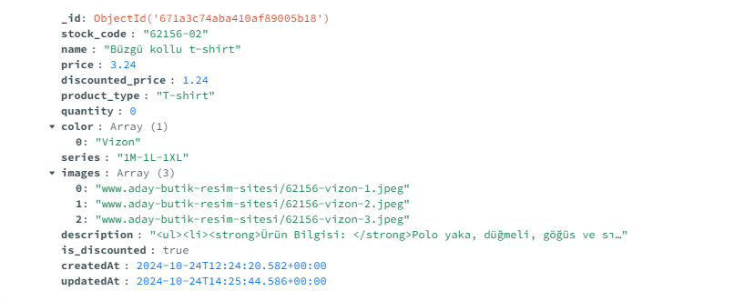

# Product Importer to MongoDB

This project provides a Python script that reads product data from an XML file and imports it into a MongoDB database. The script connects to a MongoDB instance, processes the XML data, and ensures that products are either inserted or updated in the database.

## Prerequisites

Before running the script, ensure you have the following:

- Python 3.x installed on your machine.
- Access to a MongoDB database. (I used mongodb atlas database & mongodb compass)
- The required libraries installed. You can install them using pip:

```bash
pip install pymongo xmltodict
```

## Configuration

1. **MongoDB Connection String**: Create a `.env` file in the root directory of your project and add your MongoDB credentials in the following format :

    ```env
    MONGO_URI=mongodb+srv://<username>:<password>@cluster0.jwuxt.mongodb.net/?retryWrites=true&w=majority
    ```

2. **Database and Collection**: Modify the following lines to specify your database and collection names:

    ```python
    db = client["lonca"]
    products_collection = db["demo"]
    ```

3. **XML File**: Ensure the XML file (`lonca-sample.xml`) is located in the same directory as the script or provide the full path to the file in the code.

## Script Overview

### 1. Importing Libraries

The script uses the following libraries:

- `pymongo`: For interacting with MongoDB.
- `xmltodict`: To parse XML data into Python dictionaries.
- `datetime`: To handle date and time for the `createdAt` and `updatedAt` fields.

### 2. Reading XML Data

The script reads the XML file and parses it into a Python dictionary:

```python
with open("lonca-sample.xml", "r", encoding="utf-8") as file:
    data = xmltodict.parse(file.read())
```

### 3. Formatting Product Data

The `format_product` function is responsible for transforming the product data into a format suitable for MongoDB. It handles various product attributes and ensures they conform to the required types.

### 4. Inserting and Updating Products

The script iterates through the parsed products, checking if each product already exists in the MongoDB collection:

- If the product exists, it updates only the changed fields and the `updatedAt` timestamp.
- If the product does not exist, it inserts a new document.

### 5. Closing the Connection

After completing the insertion and update process, the script closes the MongoDB connection:

```python
client.close()
```

## Running the Script

To run the script, simply execute it in your terminal:

```bash
python main.py
```

## Optimization Tips

### Bulk Write Operations

For better performance when inserting or updating multiple documents, I consided using bulk write operations. This allows to perform multiple write operations in a single request, reducing the number of round trips to the database.


## Product Importer Overview

Here’s a screenshot of the Product Importer in action:




